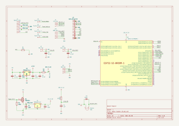
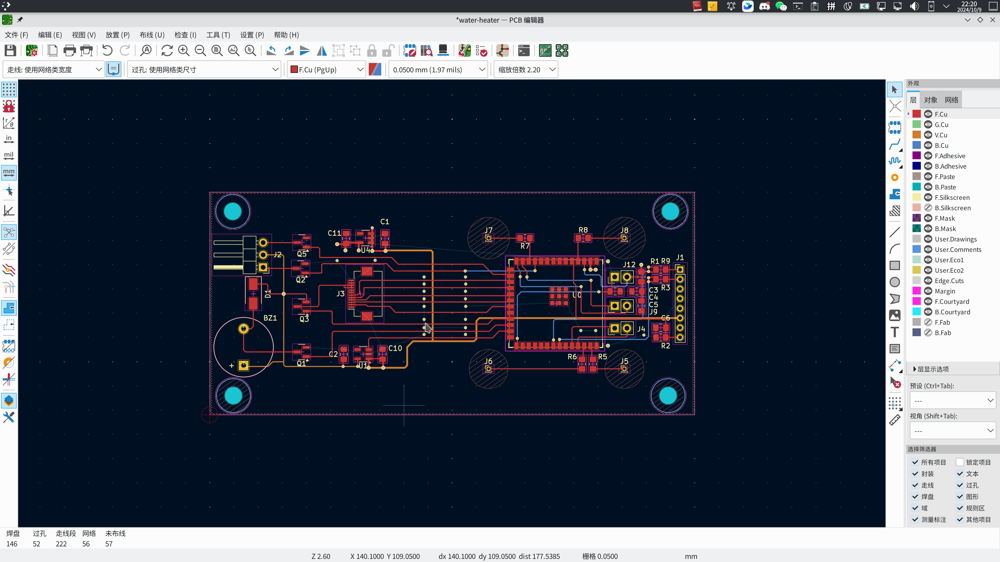

## Open-source Solar Water Heater Control

This project upgrades traditional solar water heaters for smart operation. The firmware uses ESPHome for simplicity and ease of use. 

For more details and insights, please visit my blog. [https://blog.lastline.tech](https://blog.lastline.tech)

## Circuit Diagram

## PCB

